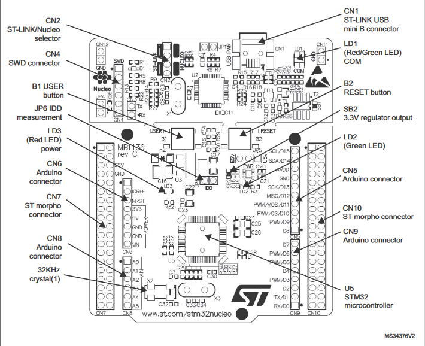
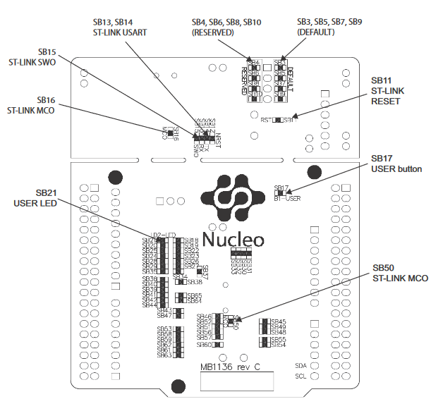
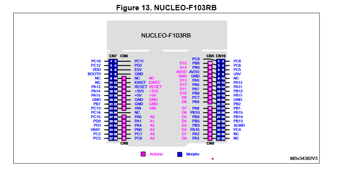
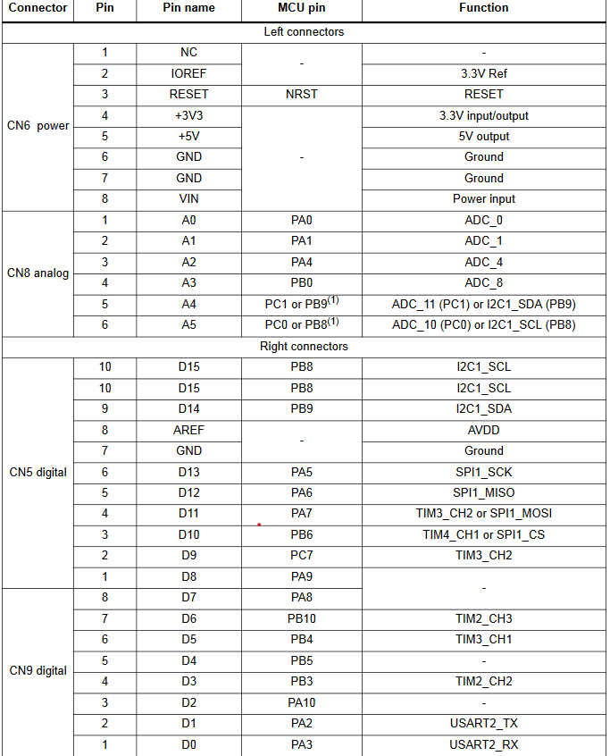
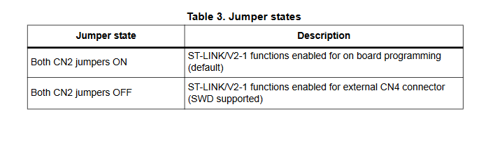
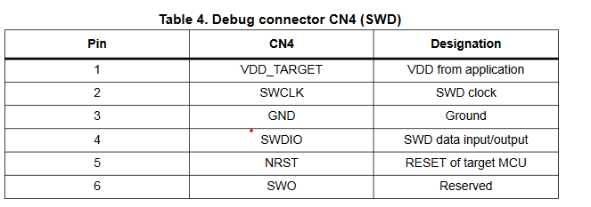

# Carte Nucleo 103
## Overview and Layout
### The top 

### The bottom 

### PINS 
- **View :** 

-**Table :**

### Specifications
- **CN2 :** 

- **CN4 :**(Serial Wire Debug)

- **LEDS : ** 

  -**LED1(LD1;COM):**
The tricolor LED (green, orange, red) LD1 (COM) provides information about ST-LINK
communication status. LD1 default color is red. LD1 tums to green to indicate that
communication is in progress between the PC and the ST-LINK/V2-1, with the following

setup:
    -Slow blinking Red/Off: at power-on before USB initialization

    -Fast blinking Red/Off after the first correct communication between the PC and
ST-LINKIV2-1 (enumeration)

    - Red LED On: when the initialization between the PC and ST-LINK/V2-1 is complete
    -Green LED On: after a successful target communication initialization

    -Blinking Red/Green: during communication with target

    -Green On: communication finished and successful

    -Orange On: Communication failure

  -**User LD2:**

the green LED is a user LED connected to Arduino signal D13 corresponding to
MCU 1/0 `PA5` (pin 21).

  -the l/Ois HIGH value, the LED is on
  -the l/Ois LOW, the LED is off

  -**LD3 PWR:** the red LED indicates that the MCU part is powered and +5V power is available.

-**Push buttons :**

  -B1 USER: the user button is connected to the 1/0 `PC13` (pin 2) of the STM32
microcontroller.

  -B2 RESET this push button is connected to NRST, and is used to RESET the STM32
microcontroller.

**NOTE:**The blue and black plastic hats that are placed on the push buttons can be removed if
necessary, for example when a shield or when an application board is plugged on top of the
Nucleo board. This will avoid pressure on the buttons and consequently a possible
permanent target MCU RESET.

- ** Buttons : **

